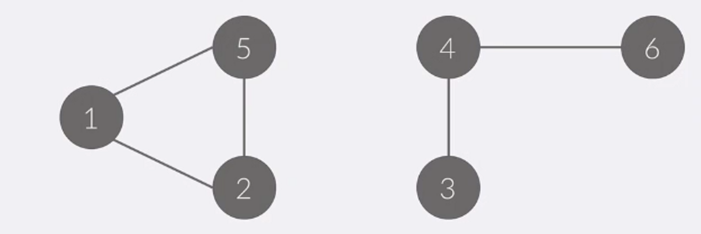

1.연결요소.
 - 그래프가 나누어져 있지 않은 경우가 있을수 있다.
 - 이렇게 나누어진 각각의 그래프를 연결 요소라고한다
 - 연결 요소에 속한 모든 정점을 연결하는 경로가 있어야한다
 - 또 다른 연결요소에 속한 정점과 연결하는 경로가 있으면안된다

 - 아래 그림은 1개의 그래프가 2개의 연결 요소로 이루어져 있다.
 - 

 - 연결 요소를 구하는 것은 DFS나 BFS로 구할 수 있다.
 
 
2.이분그래프
 - 그래프를 A와 B로 나눌 수 있으면 이분 그래프라고한다.
 - A에 포함되어 있는 정점끼리 연결되어 있는 간선 없음
 - B에 연결되어 있는 간선없음.
 - 모든 간선은 양끝점은 A에 다른끝점은 B에 속함.
 - 

 - 이 걸 알려면 CHECK[I] 의 의미가 변형되어야함
 - check[i] = 0 (아직 x)
            = 1 (방문 O), 빨간색
            = 2 (방문 O), 파랑
        
3.싸이클 찾기 (항상 어떤정점이 어떤 하나의 정점으로만 연결될때)
 - 순열이 주어졌을때, 순열의 사이클 개수를 찾아보자.
 - dfs를 이용해서 이미 방문했던 수를 방문하면 return 하는 방식으로 품.
   i: 1 2 3 4 5 6 7 8
p[i]: 3 2 7 9 1 4 5 6
 - 
    [위와 같은경우가 싸이클임]
    위와 같은 문제룰 풀떄, 인접 리스트,행렬을 쓸필요는 없음
    왜냐하면 하나의 정점은 하나의 간선만 가지기때문에
    a[i]; i->?
4.반복수열.
  check[i] = 0 방문 x
  check[i] != 0 몇번방문했을까

5.텀 프로젝트 : 조를짜고싶은 조건에도 
               어떤 조에도 속하지 않는 사람의 수 구하기
    i:1 2 3 4 5 6 7
 A[i]:3 1 3 7 3 4 6

  - 이문제는 싸이클을 구하는 문제처럼 보이지만 아닙니다.

6.플러드필
 - 어떤 위치와 연결된 모든 위치를 찾는 알고리즘

 (1) 정사각형 모양의 지도가 있다
 (2) 0은 집이 없는곳, 1은집이있는곳
 (3) 지도를 가지고 연결된 집의 모임인 단지를 정의하고 단지에 번호를 붙인다.
 (4)연결:좌우 아래로 집이있는경우
 - 
 - 그래프 문제지만 인접리스트나 행렬을 만들필요가없다
   *모든 칸마다 네칸을 검사해야하기 때문이다.

7.미로탐색
 - (1,1) 에서 (N,N)까지 가장 빠른 길을 구하는 문제
 - DFS탐색으로는 풀 수 없다.
 - BFS 탐색을 사용해야한다, BFS는 단계별로 진행된다는걸 이용.
 
 - bfs는 위 그림과 같이 단계별로 탐색을 수행한다.
 - 모든가중치가 1 이면 bfs를 이용해서 구할 수 있다.
 - dfs는 최단거리를 보장하지는 않는다.

 
 - 위와같이 이동할수 있는 경로를 표시해보면 가장 최저거리를 구함
 - dist[i] = 시작 =>i에서 거리
  dist[next] = dist[now] + 1 //거리를 구하는코드

8.다리 찾기
 - 단지번호 붙이기 + 토마토문제
 - 먼저 섬을 그룹을 나눈다.
 - g[i][j] = (i,j) 의 그룹번호.
 - 그리고 나서 각각의 그룹에 대해서 다른섬까지의 거리를 계산
 - 이 방법ㅇ은 각각 그룹에대해서 bfs를 수행해야 하기땜에느림
------------------------------------
3:10451
4:2331
5:9466
6:2667, 4963
7:2178,7576
8:2146