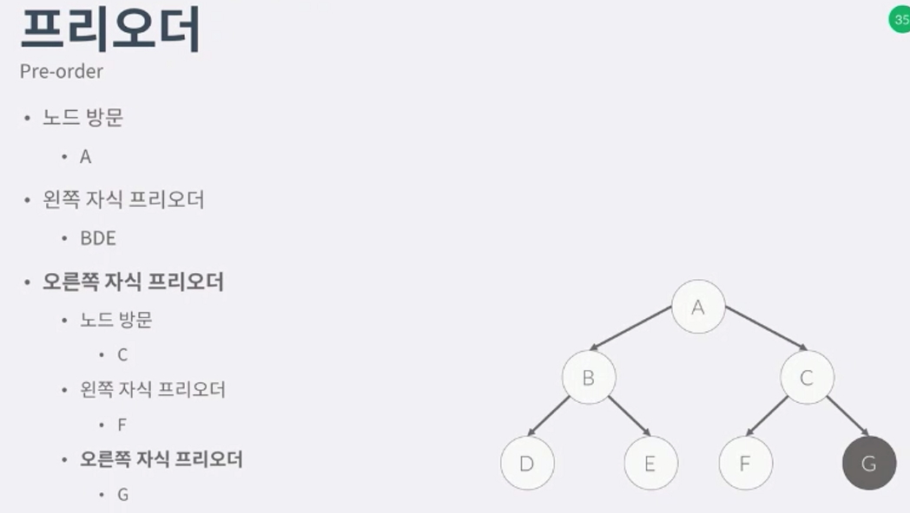
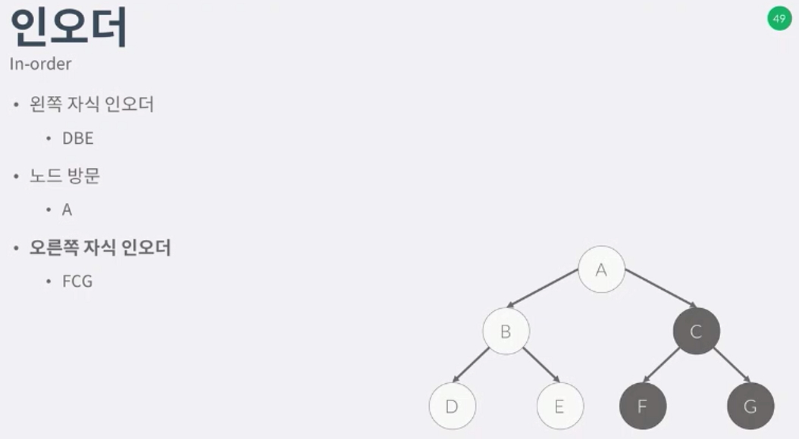
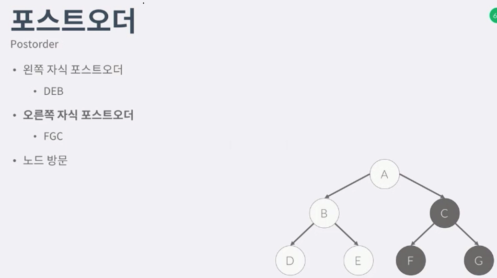
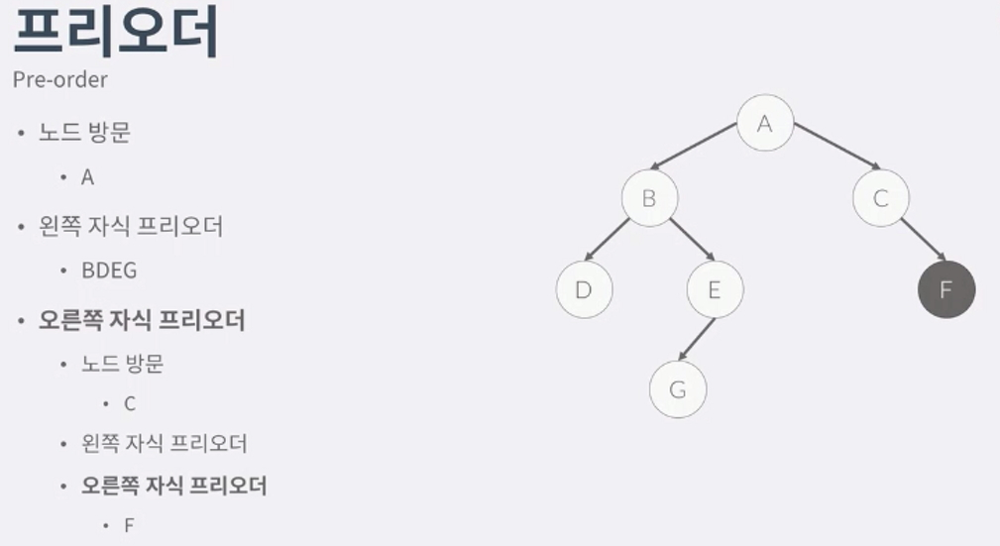
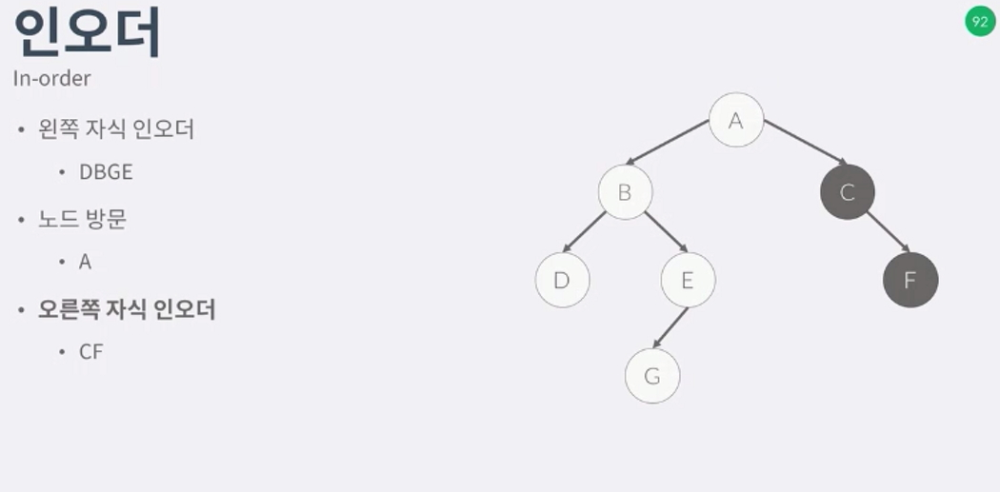
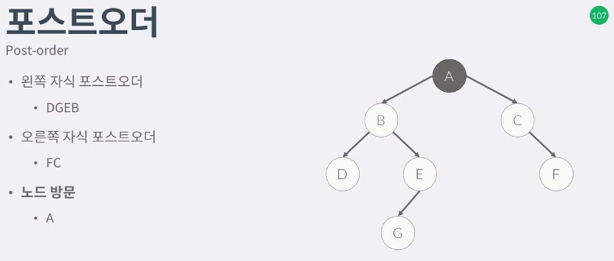
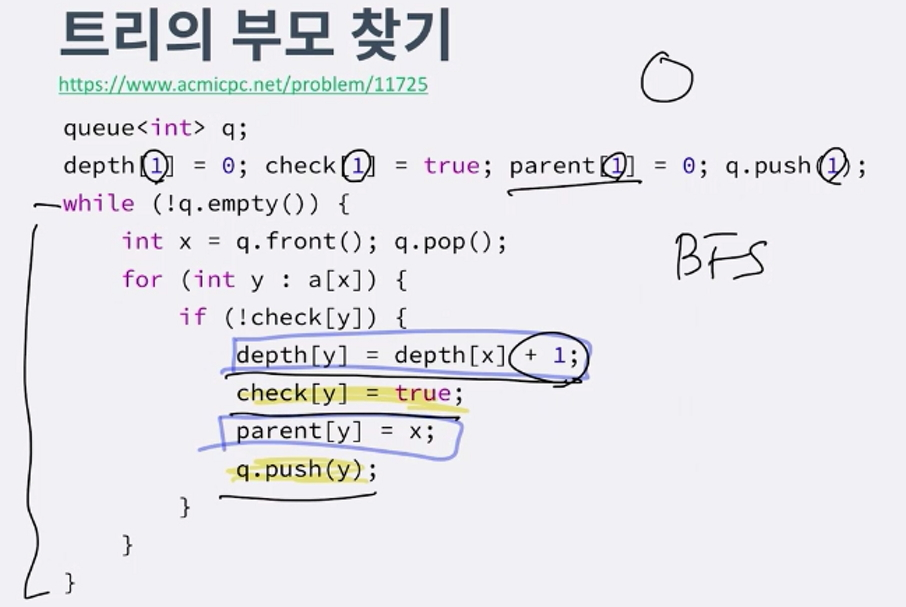
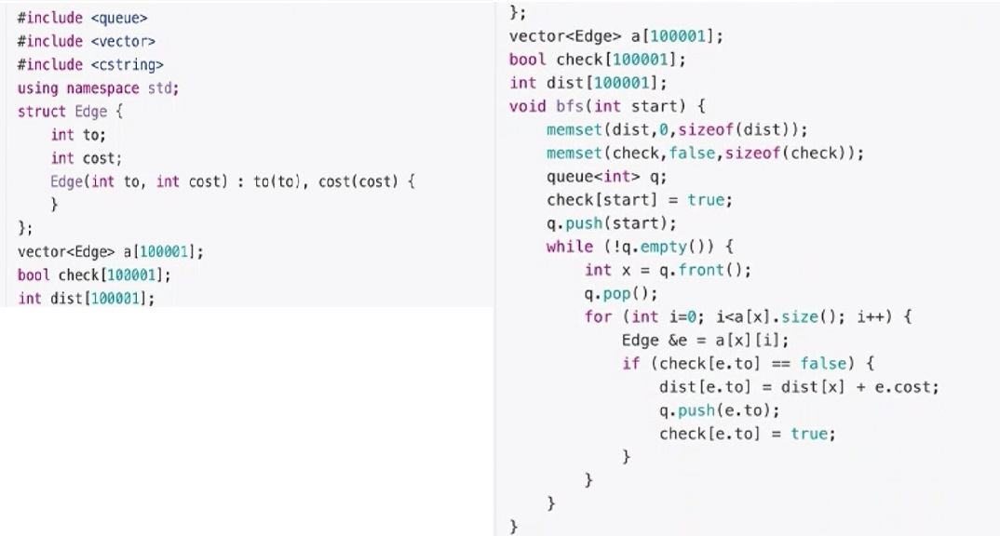

트리의 순회
-----------------
 - 트리의 모든 노드를 방문하는 순서이다
 - 그래프의 경우에는 DFS, BFS 가 있다.
 - 트리에서도 위의 두 방법을 사용 할 순 있지만 이진트리만의 방법이 있다.
 - 프리 오더 (전위)
    - 1. 노드방문
    - 2. 왼쪽 자식의 노드를 루트로 하는 서브트리 프리오더
    - 3. 오른쪽 자식의 노드를 루트로하는 서브트리 프리오더 
 - 인 오더 (중위) 
    - 1. 왼쪽자식의 노드를 루트로하는 서브트리 인오더
    - 2. 노드방문
    - 3. 오른쪽 자식의 노드를 루트롤 하는 서브트리 인오더
 - 포스트 오더 (후위)
    - 1. 왼쪽 자식의 노드를 루트로 하는 서브트리 포스트오더
    - 2. 오른쪽 자식의 노드를 루트로하는 서브트리 포스트오더
    - 3. 노드방문
 - 세 방법의 차이는 루트를 언제 방문하느냐의 차이이다.

프리오더
-------------
 - 
 - 위와 같은 순서로 방문하게 된다.
 - 그래프의 dfs와 순서가 같다.

인오더
--------------
 - 
 - 사용용도는 BST(binary search tree) delete 를 구현할때 사용된다

포스트 오더
--------------
 - 
 - 가장 많이 쓰는 오더이다
 - 이유는 dynamic을 한다치면은 노드방문전에 모든 자식을 방문해야하기때문

이진트리가 아닌 프리오더
-----------------------
 - 

이진트리가 아닌 인오더
-----------------------
 - 

이진트리가 아닌 포스트오더
-----------------------
 - 

문제
-----------------

1. 순회 문제 : 1991
 - 문제의 조건은 항상 A가 루트노드이고 그리고 왼쪽, 오른쪽이 주어짐
 - 입력은 26개 이하.
 - A[i][0] = 왼쪽자식 , A[i][1] = 오른쪽자식
 - A: 65 ~ 65 + 26 - 1
 - 단순화를 위해 0 ~ 25 까지저장
 - [!image](./img/7preinpost.jpg)
 - 형태는 항상 똑같은데 어디서 출력할찌만 다르다.
 - [!image](./img/8.jpg)
 - 이진트리가 아닌경우에는 프리와 포스트오더만 있다고 생각하면된다.

2. 트리의 탐색
 - 트리는 싸이클이 없는 그래프이다. 그러므로 BFS,DFS는 자동적으로 최단거리 알고리즘이된다.
 - 문제에는 트리라고 써있지않지만 우리가 트리임을 파악해야한다.
 - ex)도시가 n개이고 도로가 n-1개 이다. -- 아직까지 알 수 없다.
 - ex)+연결되어 있는 그래프이다. 임의 두도시 사이에 경로가 항상 있다. -- 트리의 조건
 - +방향도 x여야한다

3. 트리의 부모찾기 문제: 11725
 - 트리를 그래프로 입력받고
 - 루트는 1이라고 했을때
 - 각 노드의 부모를 찾자
 - BFS로 해결가능. 그러나 DFS로도 해결가능하다.
 - 1. 조건 간선이 존재해야함
 - 2. check[next] = false  - 넥스트로 갈수가 있따.
 - 3. parent + next = now 가 된다.
 - 4. now의 뎁스도 알수가있다. depth[now] + 1 은 next의 뎁스
 - 
 - 기존 bfs와 트리 뎁스를 구하는 bfs의 차이점

4. 트리의 지름을 구하는 알고리즘 : 1167, 1967
 - 트리의 지름이라는 것은 트리의 존재하는 모든경로중 가장 긴것.
 - 탐색 두번으로 구할 수 있다.
 - 1. 루트 or 임의의 정점에서 모든정점까지 거리를 구한다. (꼭 루트가 아니어도 된다.)
 - 2. 가장 먼거리엿던 정점을 A를 구하고 그다음에 모든 정점의 거리를 구한다.
 - 3. 가장 먼거리가 지름이다.
 - 
 - 다음 엣지를 저장하는 인접리스트를 만들고 bfs를 두번하기때문에 초기화 해주어야한다.
 - 엣지에 코스트만큼을 더해주면, 그게 dist 가된다.