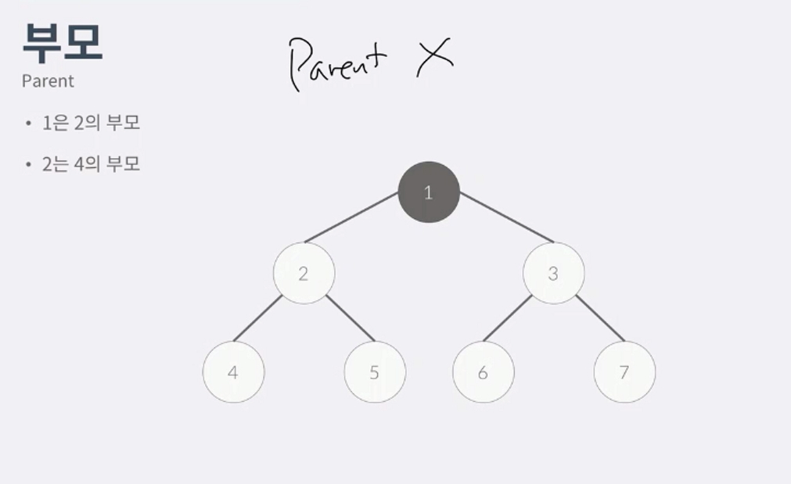
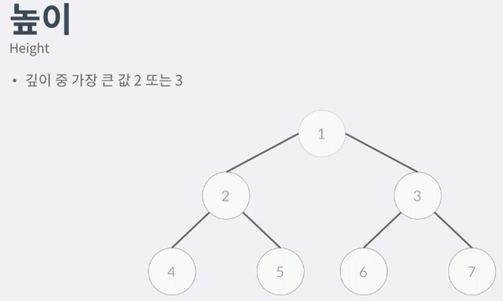
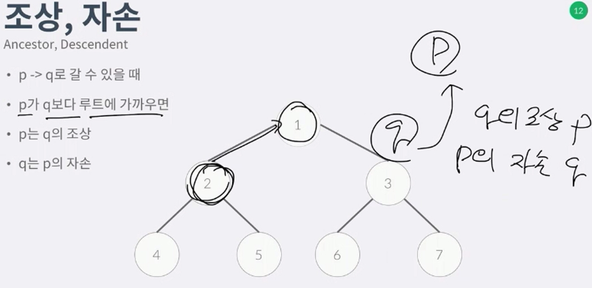
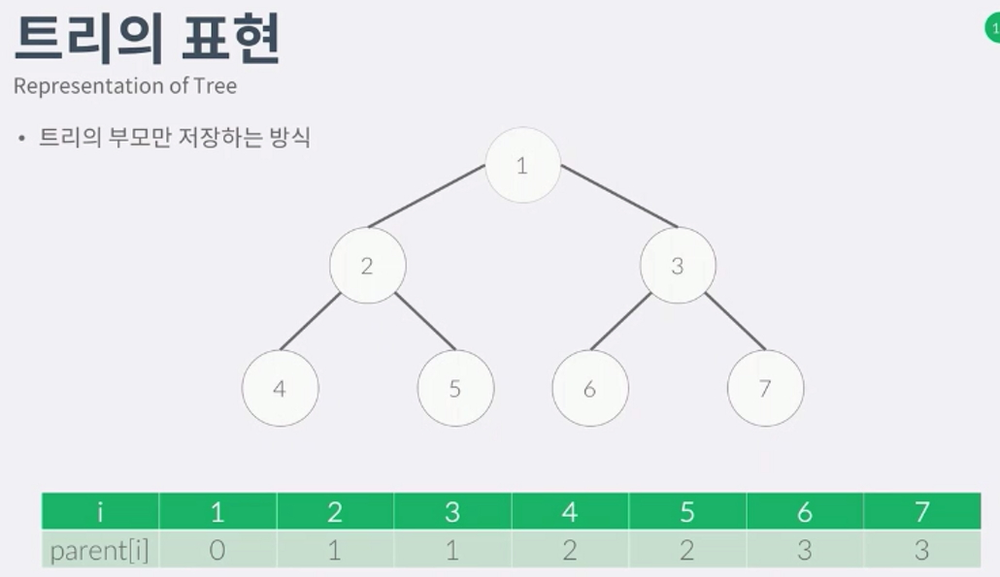
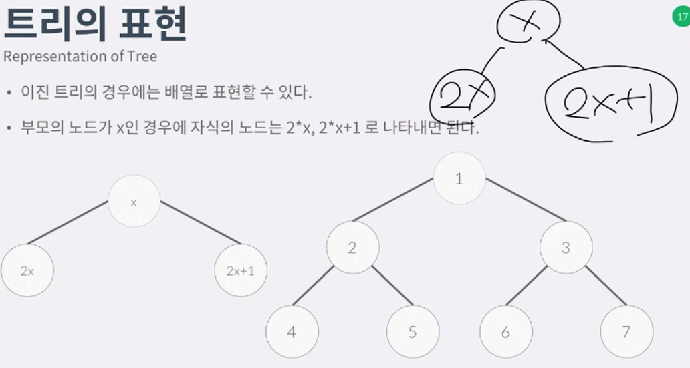

1. 트리

 - 사이클이 없는 그래프.
 - 정점의 개수가 V라면 간선은 V-1 이다

2. 루트 
 - 루트가 있는 트리, 루트는 내가 임의로 정할수있다. 무조건 위에있다고 루트가 아니다.
 - 루트를 정한 순간부터 방향을 정할 수 있다.

3. 부모
 - 이때부터 부모를 정할수있는데 루트에 가까 운것이 부모이다.
 - 
 - 페어런트가 없으면 루트이다. 

4. 자식
 - 자식이 없으면 리프노드, 터미널 노드이다.
 - 같은 부모를 가지면 형제이다.

5. dpeth , level
 - 루트로부터의 거리, (0부터 시작할수도 1부터시작 할 수도있다. - 배열의 인덱스를 1부터 vs 0부터의 차이.)

6. heigh 깊이중의 가장큰값.
 - 
 - 0부터 시작시 2, 1부터시작시 3

7. ancester descendent
 - 
 - 루트에 가까우면 조상, 멀면 자식, 1-2-3 2의 조상은 2와 1 이다 (자기자신도 포함) p->q 경로가 연결됐을때만 조상이됨

8. 이진트리
 - 자식을 최대 2개만 가질 수 있는 트리.

9. 트리의 표현
 - 트리는 그래프이기때문에 그래프 저장하듯이 저장 할 수있따.
 - 트리는 노드가 V일시 간선은 V-1 이기때문에 인접행렬로 저장하면 비효율적, 인접리스트가 더 효율적이다.
 - 트리는 부모가 0개(루트) 또는 1개이다. 
 - 
 - 위는 트리의 저장방식, 부모를 저장하는 식으로 할수있따.
 - 위 방식이면 부모를 찾기에는 O(1) 이고 자식을 찾으려면 O(v) 가걸림(비효율적)

10. 이진트리의 표현
 - 
 - 이진트리의 표현은 배열을 이용해 저장가능하다.
 - 일반적인경우에는 트리의 자식을 알 수가 없으므로 그래프 저장하듯이 저장한다.