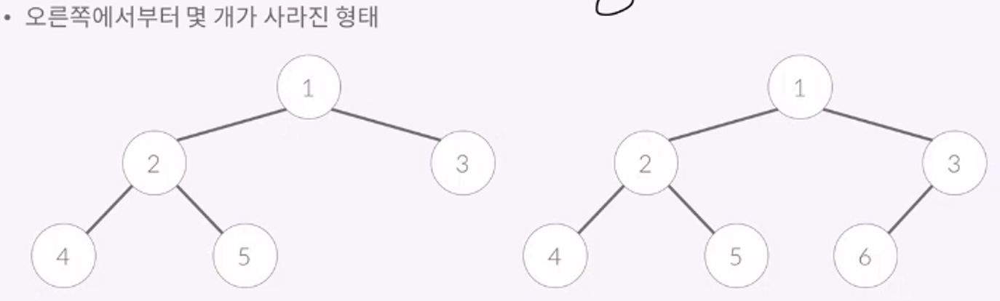
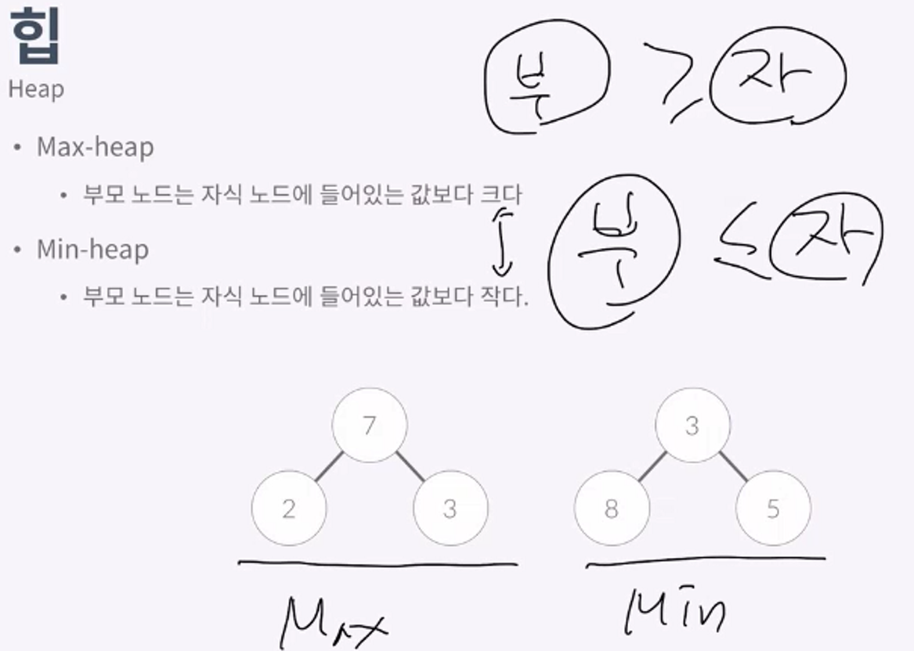
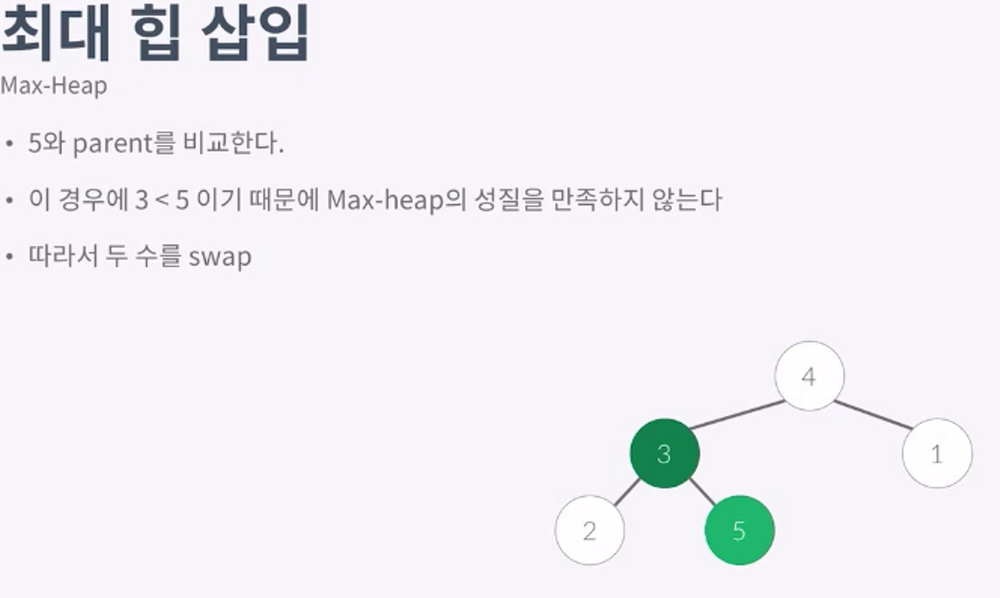

heap

Perfect Binanry tree
---
- 리프 노드를 제외한 노드의 자식수:2
- 리프 노드의 자식수:0
- 모든 리프노드의 depth가 가탕야함
- 높이가 h인 트리노드의 개수는 2^h-1

Complete Binary tree
---
- 리프노드를 제외한 노드의 자식수 : 2
- 리프노드의 자식수:0
- 마지막 레벨에는 노드가 일부 없을수도있음
- 
- 노드가 써있는 것을 저장하는 배열의 인덱스 라고 생각하면, 배열로 만드는게 가장 효율적임

Heap
---
- 

## Max-heap(최대힙)
- 가장 큰값은 루트에 
- N개가 Heap에 들어가있으면 높이는 lgN이 된다.

## 최대 힙삽입
- 가장 마지막위치에 새로운수를 넣는다
- 그 수와 parent를 계속해서 비교해가면서
- 루트 < 자식이면 두수를 바꿔준다
  
- 이 max힙에 5를넣어보자

## 제거
- 루트를 가장 마지막에 있는값으로 바꿈.
- childrent과 비교하면서 아래로 내려감
- Max-Heap이기때문에
- 루트 >children을 만족하려면
- 4와 1을바꿈
- 삽입은 위로만, 제거는 아래로만 내려감
- 삽입,제거는 O(lgN) (이유는 높이는 lgN이기 떄문에)

## 최소힙은
- 최대힙과 모든연산을 반대로하면된다.

## 모든수를 
- 모든수를 한번씩 한번 넣어다빼면 heap 정렬이다.
- lgN 이라는 시간이걸린다.

---
11279
1927