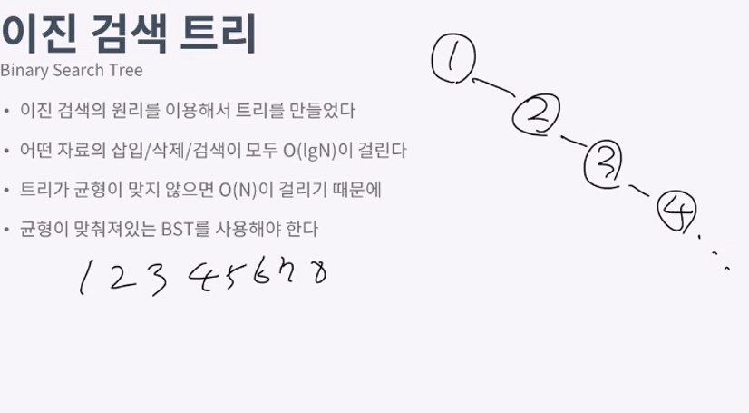
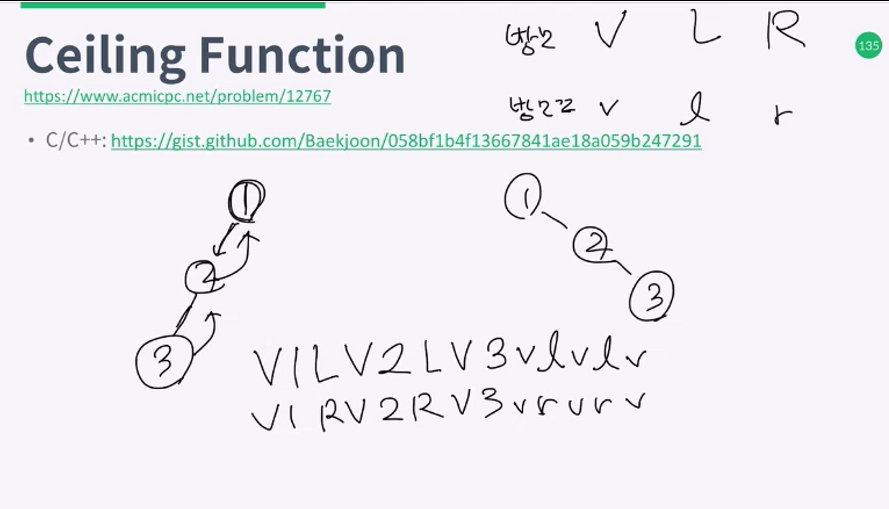

이진검색트리
===
- 이진트리
- 현재노드의 왼쪽 서브트리에는 항상 현재 노드의 값보다 작은값이 들어감
- 오른쪽 서브트리에는 항상 작은값
- 이분탐색의 원리를 통해구현

- 
- 위와 같이 1, 2, 3, 4,... 순서대로 입력될경우 균형이 맞지않는 O(n)트리가 된다. 원래(lgN)
- 균형이 맞춰지도록 BST를 구성해야한다.
- AVL-TREE, Red-Black Tree, Splay Tree, Treap이 있다.
- 이런것들은 너무 구현시 오래걸리기때문에 STL은 set (BST), java는 Tree Set을 이용한다.
- 특징은 어떤값이 있는지 검사하는데, 삭제, 추가시에 Lg N 이걸린다. (배열은 모두 N)
- Array List도 검색은 N이걸리며, 검색이 되어잇다고 가정할시 추가,삭제는 1

12767 푸는 표현식
---
- 

---
12767,
7785
1764