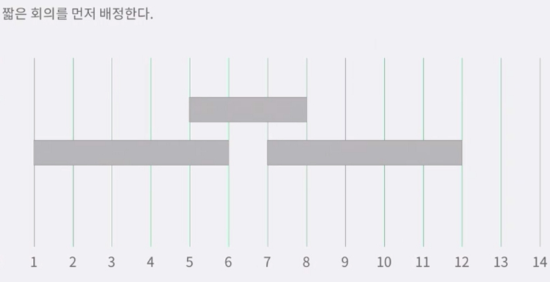
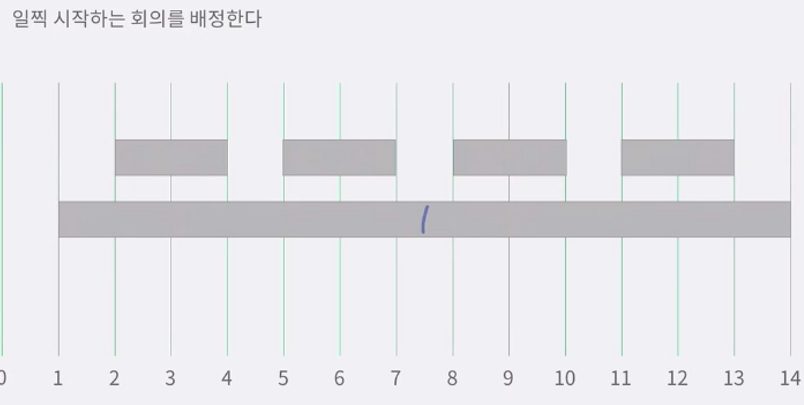
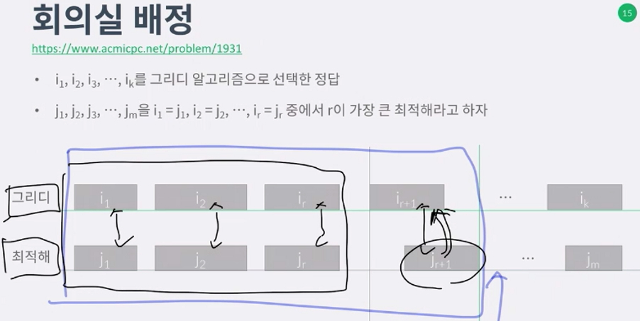
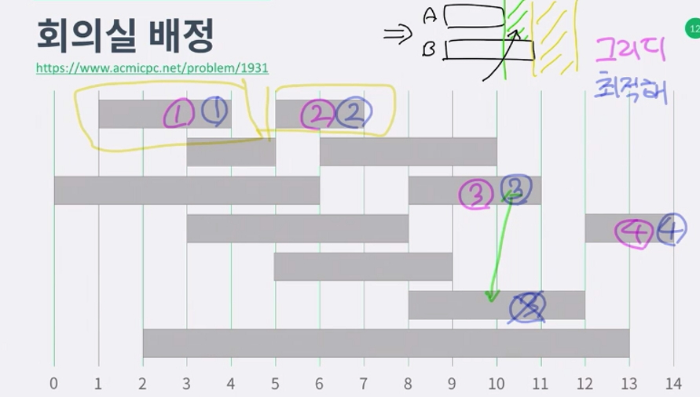
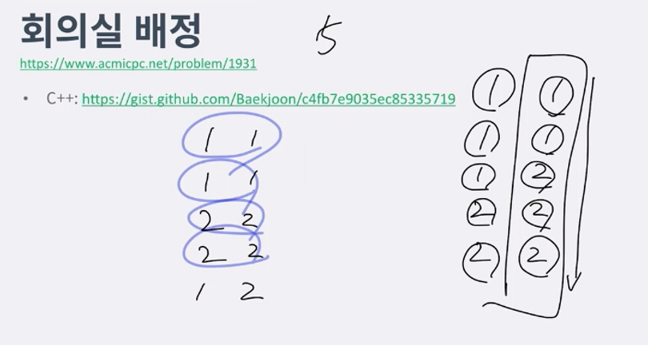

그리디 알고리즘
---------------
 - 가장 쉽다고 생각하지만 가장 어려운 알고리즘입니다. 대회에 문제가 나올경우 가장 나중에 푸세요
 - 결정해야 할 때, 그순간에 가장 좋다고 생각하는것을 선택
 - 그때그때는 최적일수도 있지만, 최종적으로는 답이 아닐수도 있음

거스름돈 문제
--------------
 - 1, 5, 10, 50 100 500 원 동전을 매우 많이 가지고 있고
 - 1천 5천 1만원 5만원 지폐를 매우 많이가지고 있을때
 - N원을 거슬러 주는 문제
 - 사용지폐와 동전을 최소 개수로
 - 가장 큰 액면가를 가진 지폐나 동전부터 거슬러주자.
 - ex) 10000 - 2430원 7570원을 거슬러 줄때
   5000 x 1
   1000 x 2
   500 x 1
   50 x 1
   10 x 2 (7개) 이 방법보다 동전이나 지폐를 최소화 할 순 없다.
 - 위는 그리디가 맞는 부분이 됩니다.
 - 반례) 1, 4, 5원 이 있는경우. 거스름돈 12원 5x2 1x2 - 총 4개.
 - 정답은 4x3 - 3개
 - 위 문제를 푼다면 다이나믹으로 풉시다 D[N] = N원을 거슬러주는 동전의 최소개수.
 - min(D[n-1], D[n-4], D[n-5]) + 1

그리디 알고리즘
----------------
 - 그럼 언제 그리디를 선택해야하나?
 - 지금 이순간 가장 좋은경우를 선택하는 것이 항상 최적인 경우에
 - 그래서 가장어렵다 -> 왜 최적인지 증명을 위해

문제 - 동전 0
-------------------
 - 1, 5, 10, 50, 100, 500
 - 7570, 1514, 757, 50x 750/5 + 10x2

회의실 배정
-------------------
 - 
 - 가장먼드는 생각, 짧은회의를 가장 먼저 배정하면 많이 배정 가능하지않을까? -> 회의가 겹쳐있을경우 위와 같은 반례존재.
 - 
 - 일찍 시작 하는 회의를 우선 배정한다면?
 - 두가지 방법중에 답이 많은걸로 푼다면 ? -> 그리디 알고리즘이 아니다.
 - 반례에 반례에 반례가 나오다보면 더러워집니다.
 - 답 : 일찍 끝나는 회의부터 배정하면 됩니다.
 - 실제로 증명은 어떻게 해야하나면?
 -  
 - 최적해와 그리디의 정답이 같지 않을때가 있습니다. 최적해의 정답을   그리디로 바꿔보면 둘이 같음을 볼 수 있습니다.
 - 정렬을 해주면된다. 일단.
 - 
 - !! 그러나 종료조건만 가지고 정렬을 하면 안된다. 끝나는 시간이 같을때 시작시간을 비교해줘야한다.

ATM 문제
------------
 - 사람들의 줄을 적절히 바꿔서 돈인출 시간을 최소로 바꿔라.
 - 정답은 오름차순이다. - 비내림 차순 (Non decreasing order) 
 - 왜 위의답인가?? 증명을 해야한다.

이번단원 문제들
---------------------------------------------
1. 동전 0: 11047
2. 회의실 배정: 1931
3. ATM : 11399