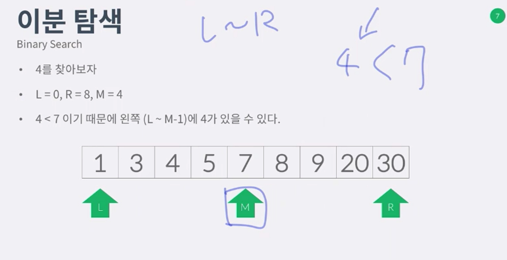
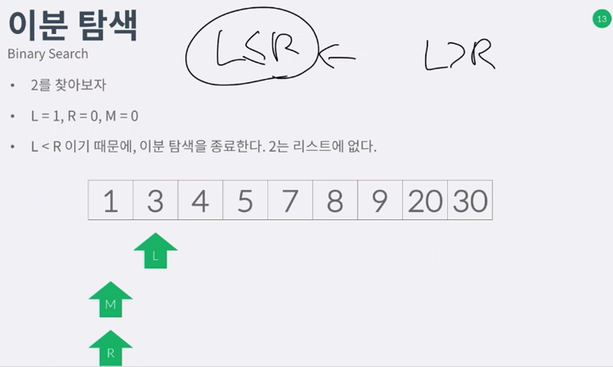

분할정복 
-------------
 - 분할정복은 문제를 2개또는 그이상의 작은 부분문제로 나눈다음 품
 - 푼다음에는 합친다음에 다시 풀경우도 있음
 - 퀵소트, 머지소트, 큰수곱셉 (카라추바 알고리즘), FFT
 - 분할정복 vs 다이나믹
 - 분항정복 : 문제가 겹치지 않음(지난답 저장 x)
 - 다이나믹:문제가 겹쳐서 겹치는것을 Memoization으로 해결

이분탐색
-----------------
 - 
 - binary search
 - 정렬되어있는 리스트에서 어떤 값을 찾는 알고리즘
 - 리스트의 크기를 n이라고 했을때 log n 이 걸림
 - 리스트의 크기를 N -> N/2 -> N/4 ....... 는 lg N 을 나타냄

 - 
 - L > R 이 되었는데도 수가 없엇으므로 2는 리스트에없다. 

머지소트
------------------
 - N개를 정렬하는 알고리즘
 - N개를 N/2, N/2 로 나눈뒤 정렬한다.
 - 두 정렬한 결과를 합친다.

문제 풀이
--------------------
 1. 분할정복 문제는 어떻게 함수를 만들어야 할지 결정해야한다.
 2. 함수-> 문제를 푸는함수
 3. 그 함수내에서는 작은문제를 어떠헥호출할것인가
 4. 만약에 부분 문제의 정답을 합쳐야 하는 경우에는 합치는것을 어떻게해야할지결정.

문제
------------------
배열합치기 11728
종이의 개수 1780
하노이탑의 이동순서 11729