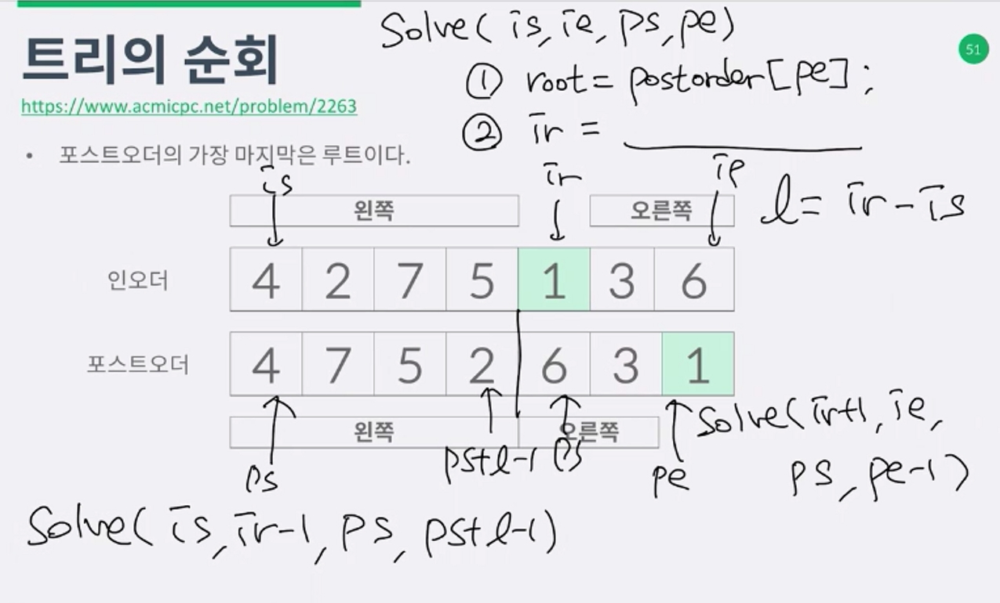

트리의 순회
------------------
 - 인오더와 포스트 오더가 주어졌을때 프리오더를 구하라,
 - 프리 루트 L R 
 - 인오더 L 루트 R
 - 포스트 L R 루트: 맨 마지막이 루트라는걸 바로 알 수있음
 - 루트를 기준으로 짜르면 인오더에서 왼쪽자식과 오른쪽 자식을 알 수있다.
 - 다시 포스트오더의 루트를 찾아서 왼쪽과 오른쪽을 나눌 수있다.
 - 구현은 어떻게 해야 할까? 
 - solve(is, ie, ps, pe);
 - 
   1. root = postorder[pe];
   2. ir = 
   3. l(왼쪽자식의수) = ir - is;
   4. solve(is, ir-1, pl, ps+l-1)[왼쪽부분]
   5. solve(ir+1, ie, ps, pe-1)[오른쪽부분]

쿼드트리
------------------
 - 트리의 순회문제랑 비슷해요

별찍기10
-------------------
 - 가운데는 빈칸이고 나머지 3칸은 재귀적인 호출을갖는다.

Z - 10:50까지봄
-----------------

문제
-------
2263
1992
2447
1074