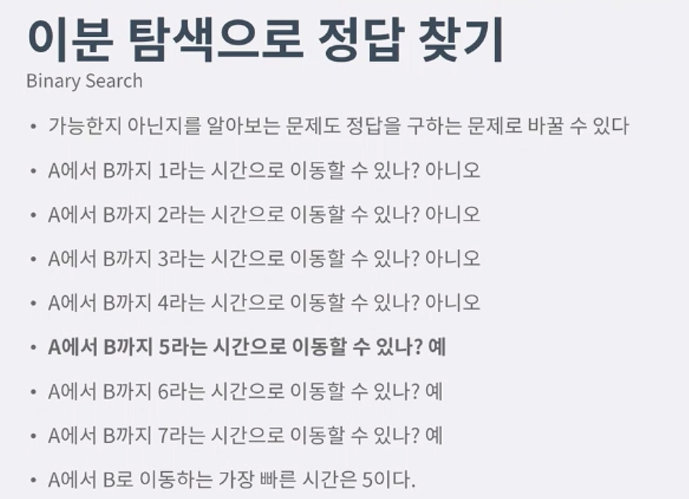

이분탐색으로 정답 찾기
---------------------------
- 정답을 구하는문제(최적화 문제)
    - A에서 B 까지 가는 가장빠른시간 구하기
- 가능한지 살펴보는 문제(Yes/No)
    - A에서 B까지 X라는 시간으로 이동 할 수있나? 

- 최적화를 풀수있으면 -> yes/no 가능 반대도 가능
- 정답을 구하는 문제는 가능여부를 판별하는 문제로 바꿀 수 있다.
    - M보다 빠른시간은 모두 불가능
    - M보다 큰시간은 모두 가능
- yes/no 문제를 최적화로 바꾼다면?
    - 

- 1[image](./img/2.jpg)
- 결론 : 어떤 기준을 가지고 yes|NO 가나눠지는 문제만 정답가능

랜선자르기
--------------------
cm 으로 잘랐을때 count-> N이상 = count 크게
cm 으로 잘랐을때 count-> N미만 = count 작게

이분탐색에서 가장중요한거 left right 의 값을 정해주기
left = 1 right = 가장길이가큰것

문제
-----------
랜선자르기 : 1654
나무자르기: 2805
공유기설치 : 2110